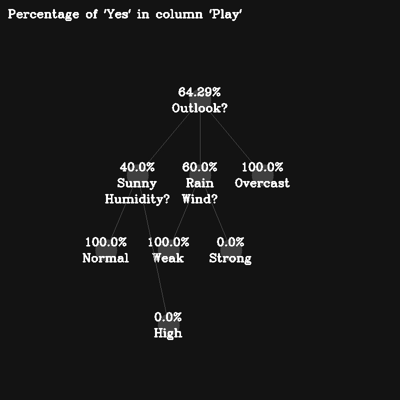
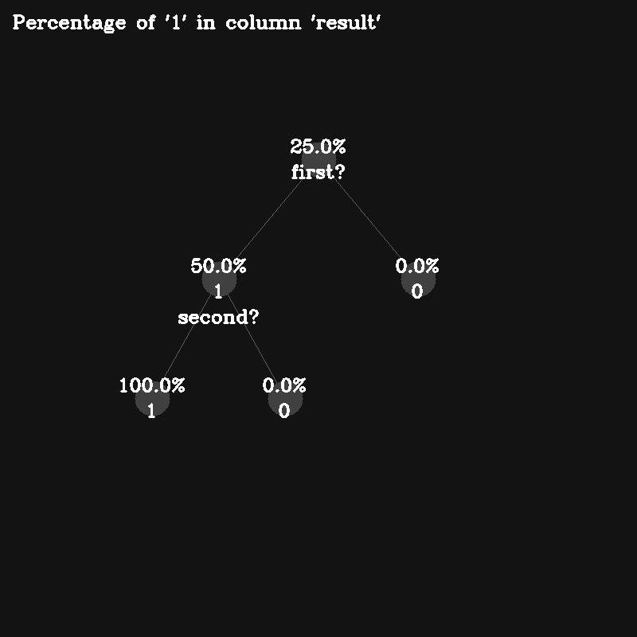

# id3-decision-tree
## Project
A python script to demonstrate the creation of a decision tree using **ID3** algorithm.
Configure **config.yaml** according to your preference and run **main.py** to see the result.
#### Example results

#### Installation

To download the project, either download the zip via GitHub or run this command:
`git clone https://github.com/ArdaOzcan/id3-decision-tree.git`

#### Getting started
After you have successfuly downloaded the project folder, you have to install **Python 3** and **pip** in order to run this project. If you have those installed, run this command:
`pip install -r requirements.txt`

#### Adding more data sets
There are a few data set available in data/ . If you want to add more, you  have to specify the location of the data set in config.yaml .
##### Requirements:
- The file has to be a .csv file or any file with comma seperated values.
- First row must contain the titles of columns.
- Last column must contain the result.

#### config.yaml
Configuration file to specify preferences, every attribute and its purpose is commented in the file.

#### Additional information
This project was built with **Python 3.7.2**